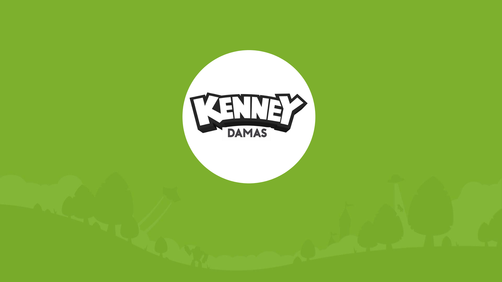
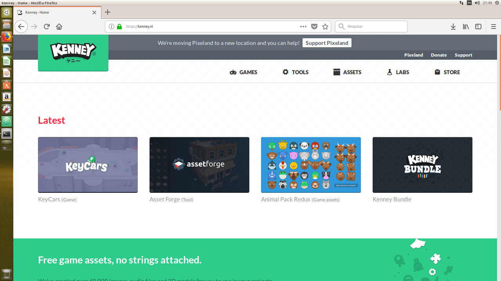
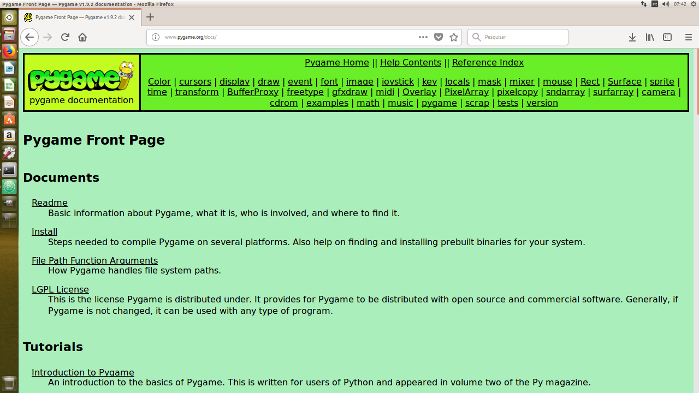

# **KENNEY CHECKERS PROJECT**

## 1. *Principal objective this project*
This is a mini-project of the course of Computer Science (UFCG) that use the Python graphical library (PyGame) with purpose of create a game of Damas.
## 2. *About Kenney damas*
This game is my first project using Python graphical library (Pygame) and was a great experience build a game from scratch, programming everything object-oriented (classes, attributes, methods, and any anothers concepts). Make a game was ever a dream for me and working with Pygame was interesting.
The game consist in a simple Checkers with brazilian rules, however, everythings assets like themes, musics and sprites are materials disponibles by Kenney game studio, that create games e offer free game assets.
## 3. *Checkers Brazilian Rules*
Brazilian Checkers is played in an 8x8 game board and 24 pieces in total (12/12) with the following rules:
* The king can move by across the diagonals it is contained
* Pieces make captures and move on diagonal
* Capture is obrigatory
* Capture most number of enemy pieces is obrigatory (Majority law) **INCOMPLETE**
## 4. *Tools used in create of game*
I used some assets for customize my game having like reference the following webpages:
* ### Kenney Official Site (sprites sheets)

* ### Kenney YouTube Channel (audio)

* ### Python Graphics Library

## 5. *Youtube Link (Video)*
* https://www.youtube.com/watch?v=u6LvBPbR_tU
## 6. *References*
* https://kenney.nl/
* https://www.youtube.com/user/Morku
* https://www.pygame.org/docs/
